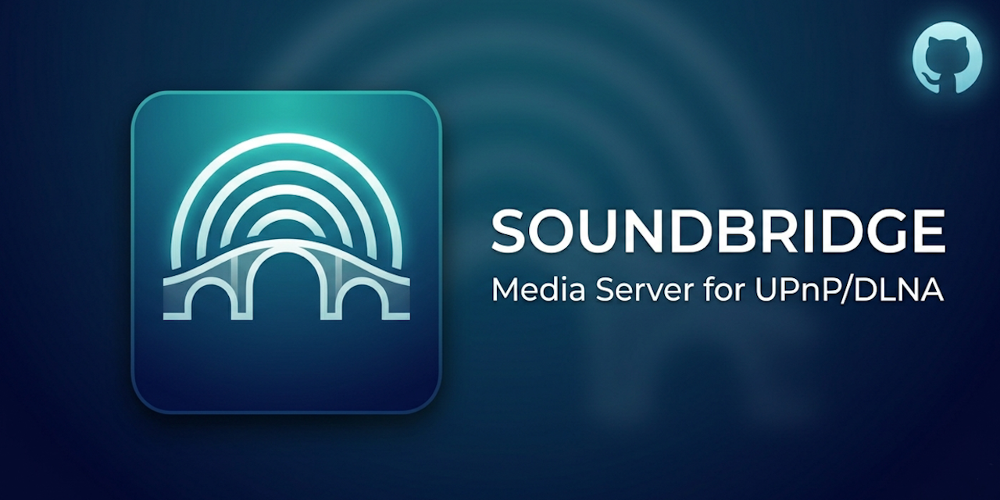

# SoundBridge



UPnP MediaServer udostępniający lokalne pliki audio wzmacniaczom sieciowym (rendererom). Korzysta z Kestrel do serwowania plików i ohNet jako stosu UPnP.

**Główna cecha: biblioteka oparta na strukturze katalogów** — SoundBridge nie czyta metadanych plików (ID3 tagów). Zamiast tego odwzorowuje strukturę folderów 1:1. Jeśli masz dobrze zorganizowaną kolekcję (`Muzyka/Artysta/Album/utwór.mp3`), renderer zobaczy ją dokładnie w tej hierarchii. Żadnego skanowania, żadnych tagów — tylko to, co na dysku.

## Uruchamianie

SoundBridge działa w trzech trybach:

| Tryb | Komenda |
|------|---------|
| **Konsola** | `dotnet run --project src/SoundBridge.App` |
| **Windows Service** | `dotnet run --project src/SoundBridge.App -- --service` (wymaga administratora do instalacji: `sc create SoundBridge binPath=...`) |
| **Docker** | `docker run -d soundbridge` |

Zaleca się ustawienie konkretnego adresu IP w `WebServerHost` zamiast domyślnego `0.0.0.0` — zapewnia to poprawne działanie UPnP (SSDP, PresentationURL, ikony) w sieci lokalnej.

## Quick start

```bash
# Zbuduj
dotnet build

# Uruchom (przed uruchomieniem ustaw WebServerHost w appsettings.json na adres IP swojej maszyny)
dotnet run --project src/SoundBridge.App
```

## Konfiguracja

Ustawienia pochodzą z dwóch źródeł — **zmienne środowiskowe mają priorytet** nad `appsettings.json`.

### Przez `appsettings.json`

```json
{
  "SoundBridge": {
    "FriendlyName": "SoundBridge",
    "UdnFilePath": "data/device.udn",
    "WebServerHost": "192.168.1.100",
    "WebServerPort": 5000
  }
}
```

> **Uwaga:** `WebServerHost` ustaw na rzeczywisty adres IP maszyny w sieci lokalnej. `0.0.0.0` spowoduje, że PresentationURL, ikony i SSDP nie będą działać poprawnie.

### Przez zmienne środowiskowe

Te same klucze, prefiks `SoundBridge__`:

```bash
# Linux / Docker
export SoundBridge__FriendlyName="MojaMuzyka"
export SoundBridge__WebServerPort=8080
```

```powershell
# Windows PowerShell
$env:SoundBridge__FriendlyName = "MojaMuzyka"
$env:SoundBridge__WebServerPort = 8080
```

### Dostępne opcje

| Klucz | Domyślnie | Opis |
|-------|-----------|------|
| `FriendlyName` | `SoundBridge` | Nazwa wyświetlana w rendererze |
| `UdnFilePath` | `data/device.udn` | Ścieżka pliku UDN |
| `WebServerHost` | `0.0.0.0` | Adres IP maszyny — **zaleca się ustawienie konkretnego IP** |
| `WebServerPort` | `5000` | Port nasłuchiwania Kestrel |

## Zarządzanie bibliotekami — Web API

Biblioteki (Local Libraries) to ścieżki w systemie plików widoczne jako główne kontenery w ContentDirectory. **Konfiguruje się je wyłącznie przez REST API** — nie ma ich w `appsettings.json`.

### `/api/local-libraries`

| Metoda | Ścieżka | Opis |
|--------|---------|------|
| `GET` | `/api/local-libraries` | Lista wszystkich bibliotek |
| `GET` | `/api/local-libraries/{name}` | Pojedyncza biblioteka |
| `POST` | `/api/local-libraries` | Dodaj nową bibliotekę |
| `DELETE` | `/api/local-libraries/{name}` | Usuń bibliotekę |

### Przykłady

```bash
# Pobierz listę
curl http://{WebServerHost}:{WebServerPort}/api/local-libraries

# Dodaj bibliotekę
curl -X POST http://{WebServerHost}:{WebServerPort}/api/local-libraries \
  -H "Content-Type: application/json" \
  -d '{"name": "Muzyka", "path": "I:\\music"}'

# Usuń bibliotekę
curl -X DELETE http://{WebServerHost}:{WebServerPort}/api/local-libraries/Muzyka
```

Biblioteki zapisywane są w LiteDB (`data/soundbridge.db`). Renderery UPnP widzą je przy Browse z `ObjectID=0`.

## Scalar API Reference

Dokumentacja OpenAPI dostępna zawsze pod `/scalar/v1` — interaktywne UI do testowania endpointów API.

## Serwowanie plików audio

Pliki serwowane są przez Kestrel pod trasą `/media/{**path}` z obsługą range requests (niezbędne do przewijania w rendererze). Dozwolone rozszerzenia: `.mp3`, `.wav`, `.flac`, `.aac`.

## Docker

```bash
# Budowa
docker build -t soundbridge .

# Uruchomienie z mapowaniem portów i wolumenem
docker run -d \
  -p 5000:5000 \
  -p 1900:1900/udp \
  -v /host/data:/app/data \
  -e SoundBridge__WebServerHost={WebServerHost} \
  -e SoundBridge__FriendlyName="SoundBridge-Docker" \
  soundbridge
```

Porty:
- `5000` — HTTP (Kestrel: API + media)
- `1900/udp` — SSDP (wykrywanie UPnP)

Wolumen `/app/data` przechowuje `device.udn`, `soundbridge.db` i logi.

## Struktura projektu

```
src/SoundBridge.App/
├── Configuration/     # SoundBridgeOptions
├── Controllers/       # LocalLibrariesController, MediaController
├── Core/              # UdnManager, DidlLiteBuilder, PathValidator
├── Library/           # IContentResolver, LocalLibraryResolver, ILocalLibraryStore, LocalLibraryStore
├── Models/            # LocalLibrary
├── Providers/         # UPnP ContentDirectory + ConnectionManager
└── Services/          # UpnpDeviceService, ContentDirectoryService
```
